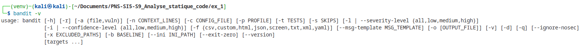

# Commandes utiles

## Setup

Testé sur Kali VM, et WSL2 Ubuntu

```bash
pip3 install virtualenv
python3 -m virtualenv -p /usr/bin/python3.11 venv
source venv/bin/activate
pip install bandit
bandit -v
```



## Exercice 1

doc : <https://bandit.readthedocs.io/en/latest/start.html#baseline>, <https://bandit.readthedocs.io/en/latest/config.html>

```bash
bandit -r . -f html -o report.html
bandit -r . -f txt -o report.txt
```

Générer un fichier de configuration

```bash
bandit-config-generator -o default-config.yml
```

Notre fichier de configuration

```config.yml
tests: [B102, B105, B106, B107, B310, B610, B608]
skips: []
```

```bash
bandit -r . -f html -o default-report.html -c default-config.yml
bandit -r . -f txt -o default-report.txt -c default-config.yml

bandit -r . -f html -o report.html -c my_config.yml
bandit -r . -f txt -o report.txt -c my_config.yml
```

Rapports disponibles :

- [default-report.html](default-report.html)
- [default-report.txt](default-report.txt)
- [report.html](report.html)
- [report.txt](report.txt)

TODO : vérifier que j'ai bien généré le bon rapport mdr

## Exercice 2

```bash
sudo apt install git
pip install semgrep
git clone https://github.com/FlorianLatapie/PNS-SI5-S9_Analyse_statique_code.git
```

Analyse sur le dossier exercice 2.

Dans le dossier que l'on souhaite analyser

```bash
semgrep ci
```

exporter le rapport

```bash
semgrep --config p/default --json --output report.json
```
